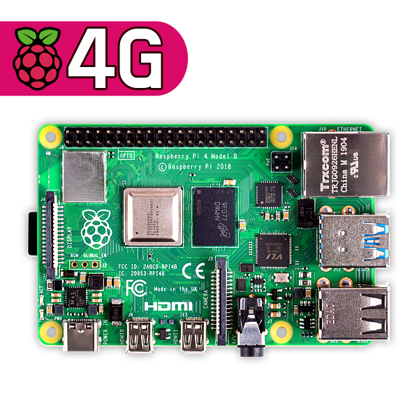
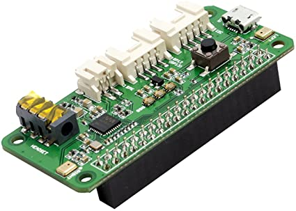
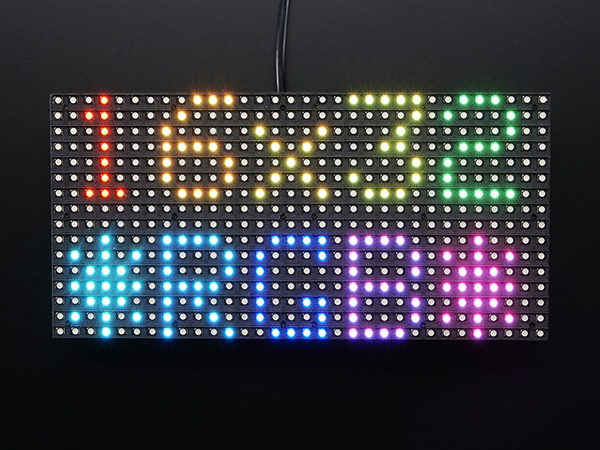
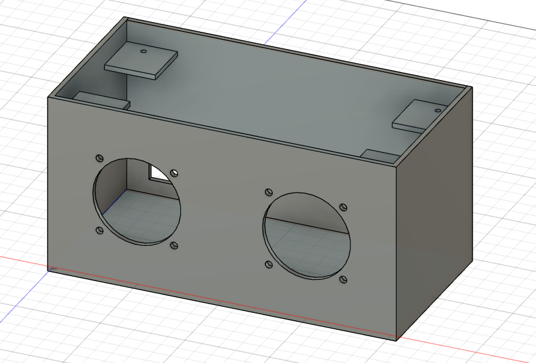

# README

## Requirements
* [Raspberry Pi 4](https://www.devicemart.co.kr/goods/view?no=12234534)

*  [ReSpeaker 2-Mics Pi HAT](http://www.11st.co.kr/products/2773517100?trTypeCd=21&trCtgrNo=585021)

* Speaker 40Ø (anything)

* [Medium 16x32 RGB LED matrix panel](https://www.devicemart.co.kr/goods/view?no=1171467)

* [Case (Fusion 360 File)](https://github.com/Hi-Class/README/blob/main/speaker.f3d)

## Install Raspbian
https://www.raspberrypi.org/documentation/installation/installing-images/

## Detail
1. [Google Assistant Speaker](http://github.com/Hi-Class/Python)
1. [LED-Matrix-Control](http://github.com/Hi-Class/Cpp)
1. [Web](http://github.com/Hi-Class/Web)